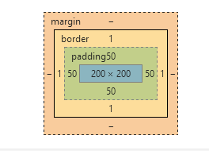

### <css>

#### 1、链接外部样式表

    <head><link rel = "stylesheet" type = "text/css" href = "FirstStyle.css"></head>

#### 2、内部样式表
    
    <head><style type = "color:red;margin-left:10px”><style></head>

#### 3、字体属性

    <font-family:”字体”>

    <font-size:大小>

    <font-style:样式的取值（normal：默认的正常字体；italic：斜体显示文字；oblique：中间状态偏斜体显示）>

    <font-weight:字体粗细值（normal：正常粗细；bold：粗体；bolder：特粗体；lighter：特细体；number：100-900范围值）>
 
    <font-variant:小写转大写（normal：正常显示；small-caps：字体较小）>

    <font:字体复合属性（family、size、style...）>

#### 4、颜色和背景属性
   
    <color:十六进制颜色值>

    <background-color:十六进制颜色值>

    <background-image:url(图像地址)>
  
    <background-repeat:是否平铺（no-repeat：不平铺；repeat：平铺；repeat-x:水平方向平铺；repeat-y：垂直方向平铺）>

    <background-attachment:背景图像是随对象滚动还是固定不动（scroll：滚动；fixed：固定）>

    <background-position:位置取值（x y）>

    <background:背景复合属性>

#### 5、段落属性

    <word-spacing:单词间隔>

    <letter-spacing:字符间隔>

    <text-decoration:文字修饰(none：不修饰；underline：添加下划线；overline：添加上划线；line-through：添加删除线；blink：闪烁效果)>

    <vertical-align:垂直对齐方式（baseline：默认垂直对齐方式；sub：文字的下标；super：文字的上标；top：垂直靠上对齐；text-top：使元素和上级元素向上对齐；middle：居中对齐；text-bottom：使元素和上级元素向下对齐）>

    <text-transform:文本转换（none：原始值；capitalize：每个单词的第一个字母大写；uppercase：每个单词的所有字母大写；lowercase：每个单词的所有字母小写）>

    <text-align:水平对齐方式（left：左对齐；right：右对齐；center：居中对齐；justify：两端对齐）>
    
    <text-indent:文本缩进>

    <line-height:文本行高>
    
    <white-space:处理空白（normal：连续多个空格合并；pre：源代码中的空格和换行符被保留；nowrap：强制在同一行显示所有文本，直到文本结束或遇到 ）>
    
    <unicode-bidi、direction:文本反排（1、bidi-override：表示严格按照direction属性的值重排；normal：默认值；embed：对象打开附加的嵌入层，direction的属性值指定嵌入层，在对象内部进行隐式重排列。2、ltr：从左到右的顺序阅读；rtl：从右到左的顺序阅读；inherit：文本流的值不可继承）>

#### 6、外边距和内边距属性

    

    1. <margin：（margin-top；margin-bottom；margin-left；margin-right）>外边距属性：设置元素周围的边界宽度
    
    2. <padding：（padding-top；padding-bottom；padding-left；padding-right）>内边距属性：设置边框和元素内容之间的间距
    
    3. <border：（border-top：border-bottom；border-left；border-right）>边框属性：调节盒子大小
    
    4. <content：（width；height；overflow）>内容区：呈现盒子的主要信息

#### 7、边框属性

    1. <border-style:（border-style;border-top-style;border-bottom-style;border-left-style;border-right-style）>

none:      |   无边框
-----------|--------------------
dotted     |点线边框
dashed     | 虚线边框
solid      | 实线边框
double     | 双实线边框
groove     | 边框具有立体感的沟槽
ridge      | 边框成畸形
inset      | 整个边框凹陷
outset     | 整个边框凸现

    2. <border-width:（border-width;border-top-width;border-bottom-width;border-left-width;border-right-width)(meidium：默认宽度；thin：小于默认宽度；thick：大于默认宽度)>

    3. <border-color:边框颜色（border-top-color；border-bottom-color；border-left-color；border-right-color）>

#### 8、定位属性

    1. <position:(static：默认值；absolute：绝对定位，同时需要使用 left，right，top，bottom等属性进行绝对定位；fixed：当页面滚动时，元素不随着滚动；relative：相对位置：对象不可叠层)>
    
    2. 元素位置: top、bottom、left、right
    
top        | auto    | 长度值、百分比
-----------|---------|------------
right      | auto    | 长度值、百分比
left       | auto    | 长度值、百分比
bottom     | auto    | 长度值、百分比

    3. 层叠顺序：z-index

    <z-index:(属性值越高，它的层就越靠上，1在最底层)>

    4. 浮动属性 ：float

    <float:设置文字在某个元素的周围（none：默认值，对象浮动；left：文字浮动在元素的右边；right：文字浮动在元素的左边）>

    5. 清除属性：clear

    <clear:制定一个元素是否允许其他元素漂浮在它的周围（none：默认值，两边都可以漂浮；left：不允许左边有浮动的对象；right：不允许右边有浮动的对象；both：两边都不允许有浮动的对象）>

    6. 可视区域：clip
    
    <clip:可以限定只显示裁切出的区域，裁切出的区域为矩形。top、left两项设置完成矩形左上角的顶点；bottom、right两项设置完成矩形右下角的顶点>

    7. 层的高度和宽度：width、height
    
    <width:宽度（auto：自动）>
    
    <height:高度(auto：自动)>

    8. 超出范围：overflow

    <overflow:超出范围时显示方式（visible：层的大小和内容都会显示出来；auto：内容超出层的范围时才显示滚动条；hidden：会隐藏超出层范围的内容；scroll：总是显示滚动条）>

    9. 可见属性：visibility
    
    <visibility:针对嵌套层的设置，嵌套层是插入在其他层中的层，分为嵌套的层和被嵌套的层（inherit：默认值，继承父对象的可见性；visible：无论父层，子层都是可见；hidden：无论父层，子层都隐藏）>

#### 9、列表属性

    <list-style:列表复合属性（list-style-type；list-style-position；list-style-image（优先））>
    1. <list-style-type:设置列表的样式>
              |
--------------|----------------------
disc          |  默认值，实心圆    
circle        |  空心圆           
square        |  实心方块         
decimal       |  阿拉伯数字
lower-roman   |  小写罗马数字
upper-roman   |  大写罗马数字
lower-alpha   |  小写英文数字
upper-alpha   |  大写英文数字
none          |  不使用任何符号

    2. <ist-style-image:图像符号（none：不指定图像；url：使用图像，地址）>
    3. <ist-style-position:列表缩进（outside：列表项目标记放置在文本以外，且环绕文本不根据标记对齐；inside：列表项目标记放置在文本以内，切环绕文本根据标记对齐）>

#### 10、光标属性cursor
             |
-------------|---------------------------------------------------------------------
auto         | 默认值。浏览器根据当前情况自动确定鼠标光标类型。
all-scroll   |有上下左右四个箭头，中间有一个圆点的光标。用于标示页面可以向上下左右任何方向滚动。
col-resize   |有左右两个箭头，中间由竖线分隔开的光标。用于标示项目或标题栏可以被水平改变尺寸。
crosshair    |简单的十字线光标。
default      |客户端平台的默认光标。通常是一个箭头。
hand         | 竖起一只手指的手形光标。就像通常用户将光标移到超链接上时那样。
move         |十字箭头光标。用于标示对象可被移动。
help         | 带有问号标记的箭头。用于标示有帮助信息存在。
no-drop      |带有一个被斜线贯穿的圆圈的手形光标。用于标示被拖起的对象不允许在光标的当前位置被放下。
not-allowed  | 禁止标记(一个被斜线贯穿的圆圈)光标。用于标示请求的操作不允许被执行。
pointer      |和 hand 一样。竖起一只手指的手形光标。就像通常用户将光标移到超链接上时那样。
progress     |带有沙漏标记的箭头光标。用于标示一个进程正在后台运行。
row-resize   |有上下两个箭头，中间由横线分隔开的光标。用于标示项目或标题栏可以被垂直改变尺寸。
text         | 用于标示可编辑的水平文本的光标。通常是大写字母 I 的形状。
vertical-text| 用于标示可编辑的垂直文本的光标。通常是大写字母 I 旋转90度的形状。
wait         | 用于标示程序忙用户需要等待的光标。通常是沙漏或手表的形状。

#### 11、滤镜属性

    1. <alpha:透明度>
               |
---------------|------------------------------------------------------------
opacity        |开始时的透明度
finishopacity  |结束时的透明度
style          |设置渐变的样式：0无渐变；1直线渐变；2圆形渐变；3矩形渐变
startx         |透明渐变开始点的水平坐标
starty         |透明渐变开始点的垂直坐标
finishx        |透明渐变结束点的水平坐标
finishy        |透明渐变结束点的垂直坐标

    2. <filter:blur:动感模糊（add=（是否显示原始图片）；direction=（动感模糊方向，按顺时针以45°为单位进行累积）；strength=（动感模糊的强度））>
    3. <filter:chroma:颜色透明处理（color=#993300）>
    4. <filter:dropShadow:阴影效果（color = 阴影颜色；offX = 水平距离；offY = 垂直距离；position = 阴影效果是否透明）>
    5. <filter:(flipH:滤镜用于设置沿水平方向翻转对象;flipV:滤镜用于设置沿垂直方向翻转对象)>
    6. <filter:Glow:发光效果（color = 颜色代码，strength = 强度值（1-255））>
    7. <filter:gray:灰度处理（把彩色图片中的色彩去掉，转换为黑白色的图片）>
    8. <filter:invert:反相（可以将图片的颜色、饱和度以及亮度完全翻转过来）>
    9. <filter:xray:（类似X光片效果）>
    10. <filter:mask:（color= 颜色代码）>
    11. <filter:wave:波形滤镜（add：用于设置是否要把对象按照波形样式打乱；freq：拥有设置图片上的波浪数目；lightstrength：用于设置波浪的光照强度，取值0-100；phase：用于设置波浪的其实位置；strength：用于设置波浪的强度大小）>

